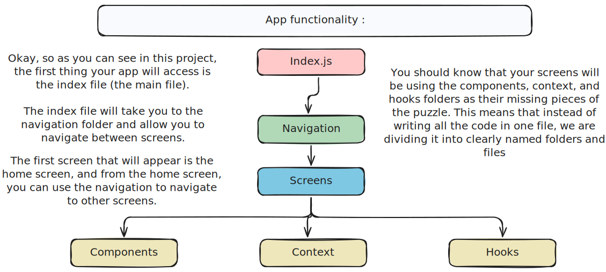

# Hello everyone 🌸
<h1>This project is in progress and is expected to be completed by Juin 25, 2025. </h1>
<p>
I created this project to deepen my understanding of React Native through hands-on implementation. Along the way, I documented key concepts and insights that I believe will serve as a valuable reference when revisiting this project. Detailed documentation is crucial for navigating older projects effectively, so take your time, stay focused, and don't get discouraged!
</p>
<hr></hr>
<h3>💙 Enjoy this journey into the world of React Native! 💙</h3>
<hr></hr>
<a id="readme-top"></a>

This is an [Expo]=project created with [`create-expo-app`](https://www.npmjs.com/package/create-expo-app).

<hr />

- [Set up project 🤗](#project-set-up-bash-commands)

- [First Lesson : Learn how to navigate inside your app ☺️](#learn-how-to-navigate-inside-your-app)

- [Seconde Lesson : Learn a new hook called useContext 🤍](#learn-about-usecontext-hook)

<hr />

## project Set-up bash commands 🤗

```bash
npx create-expo-app@latest
npm run reset-project
```

### make sure that your react native app works

```js
  the first step is to create app folder and _layout.jsx and index.jsx files and return any text
```

## $${\color{pink}Learn-How-To-Navigate-Inside-Your-App}$$

## Learn how to navigate inside your app

1. <b> First thing </b>you have to know that the best navigation approach is to use Drawer + Tabs + Stack. <br/>
   <b>Tabs</b>: Ideal for common pages like Home, Profile, and Settings.<br/>
   <b>Stack</b>: Great for workflows like opening a task’s details from Home.<br/>
   <b>Drawer</b>: Best for accessing less-used pages like Help, About, or Logout.<br/>

2. In this simple to do app we will use only stack navigation so i'll explain how to set it up so we can start properly:
   First of all you'll have to return AppNavigator component in your app or index component bc we will add to it all the screens to navigate between them easly "always look for the right way to do it and not the easiest"

3. I did create an appNavigator file in the navigation folder and i returned it in the main app component index.jsx
   and this is how your appNavigator should look like to start and make sure to install the necessary packages :

```js
import { createStackNavigator } from "@react-navigation/stack";
import { NavigationContainer } from "@react-navigation/native";
import HomeScreen from "../screens/HomeScreen";
import AboutScreen from "../screens/AboutScreen";

const Stack = createStackNavigator();

const AppNavigator = () => {
  return (
    <Stack.Navigator initialRouteName="Home">
      <Stack.Screen name="Home" component={HomeScreen} />
      <Stack.Screen name="About" component={AboutScreen} />
    </Stack.Navigator>
  );
};

export default AppNavigator;
```

4. let's say you want to<b> navigate </b> between HomeScreen and AboutScreen:
   there are two ways to navigate between screens

- First one : by using <b>navigation propos</b>
- Seconde one : by using <b>navigation hooks</b>
  the difference betwwen them is that the propos is accessed only in screen component and the hook can be used in any screen component <br/>
  => so as conclusion use navigation propos for all screen components and use navigation hook only when it is necessairly <br/><br/>

5. Now to understand the concept we should <b> test it </b>:

- So it's so simple to use navigaiton props just add the props and use it to navigate like this :

```js
const HomeScreen = ({ navigation }) => {
  return (
    <View>
      <Text>HomeScreen is working from navigation</Text>
      <Button
        title="Go to About"
        onPress={() => navigation.navigate("About")}
      />
    </View>
  );
};
```

- The same thing about the navigation hook all what you need to do is to import it and create a const that invokes the function then use it like this :

```js
import { useNavigation } from "@react-navigation/native";

const HomeScreen = () => {
  const navigation = useNavigation();

  return (
    <View>
      <Text>HomeScreen is working from navigation</Text>
      <Button
        title="Go to About"
        onPress={() => navigation.navigate("About")}
      />
    </View>
  );
};
```

<p align="right">(<a href="#readme-top">back to top</a>)</p>

## $${\color{pink}Learn-About-useContext-Hook}$$

## Learn About useContext Hook

<!-- ```diff
- text in red
+ text in green
! text in orange
# text in gray
@@ text in purple (and bold)@@
``` -->

<!-- > [!NOTE]
> Highlights information that users should take into account, even when skimming.

> [!TIP]
> Optional information to help a user be more successful.

> [!IMPORTANT]
> Crucial information necessary for users to succeed.

> [!WARNING]
> Critical content demanding immediate user attention due to potential risks.

> [!CAUTION]
> Negative potential consequences of an action. -->

1. why useContext : <br/>
   You use useContext in React when you want to avoid prop drilling (passing props through multiple levels of components) and need a way to share data globally across your component tree. and For small to medium-sized apps, using external state management libraries like Redux or Zustand might be overkill. These libraries add complexity and boilerplate code, useContext provides a lightweight way to manage and share state without needing additional libraries. <br /><br />
2. When Not to Use useContext:<br/>
   While useContext is great for sharing global state, it has some limitations:<br/>
   Performance Issues: If the context value changes frequently, all components consuming that context will re-render, which can lead to performance problems in large apps.
   Complex State Management: For large apps with complex state logic, libraries like Redux, Zustand, or Recoil might be more suitable.

<p align="right">(<a href="#readme-top">back to top</a>)</p>

3. How useContext Works:<br/>

- Create a Context: First, you create a context using React.createContext(). This returns a context object with a Provider and a Consumer.

- Provide the Context Value: Use the Provider component to wrap the part of the component tree where you want the context to be available. The Provider accepts a value prop, which is the data you want to share.

- Consume the Context Value: Inside any child component, you can use the useContext hook to access the value provided by the nearest Provider for that context.

```jsx
import React, { useContext, createContext } from "react";
import AppNavigator from "./navigation/AppNavigator";

// Step 1: Create a context

export const TaskContext = createContext();

// Step 2: Provide the context value
const TaskProvider = ({ children }) => {
  const tasks = ["task1", "task2", "task3"];

  return (
    <TaskContext.Provider value={{ tasks }}>{children}</TaskContext.Provider>
  );
};

function App() {
  return (
    <TaskProvider>
      <AppNavigator />
    </TaskProvider>
  );
}
// Step 3: Consume the context value
const HomeScreen = ({ navigation }) => {
  const { tasks } = useContext(TaskContext);
  return (
    <View>
      <Text>To-Do List</Text>
      {tasks.map((task, index) => {
        return <TaskItem key={index} task={task} />;
      })}
    </View>
  );
};
```

<hr />

## $${\color{pink}Key-Folders}$$

### Breakdown of Key Folders:

```bash

components/ – Stores reusable UI components like buttons, task items, or modals.
screens/ – Each app screen (e.g., Home, Task Details) is stored separately.
navigation/ – Keeps all navigation-related code (e.g., Stack, Tab navigators).
context/ – If using Context API, keep global state management here.
hooks/ – Custom hooks for managing app logic (e.g., useTasks.js).
services/ – Handles API requests, local storage, or any external services.
utils/ – Stores helper functions like date formatters or string manipulators.
constants/ – Defines constant values like colors, routes, and action types.

```

### Challenge use this advanced file structure in your app :

```bash
/todo-app
│── assets/                # Static assets (images, icons, fonts)
│── src/                   # Source code
│   ├── components/        # Reusable UI components
│   │   ├── TaskItem.js    # Single task component
│   │   ├── Button.js      # Custom button component
│   │   ├── Input.js       # Custom input field
│   ├── screens/           # App screens
│   │   ├── HomeScreen.js  # Main to-do list screen
│   │   ├── AddTaskScreen.js # Screen to add tasks
│   ├── navigation/        # App navigation setup
│   │   ├── AppNavigator.js # Stack or Tab navigation
│   ├── context/           # Context API (if using)
│   │   ├── TaskContext.js  # Context for managing tasks
│   ├── hooks/             # Custom hooks
│   │   ├── useTasks.js     # Hook for managing tasks
│   ├── utils/             # Utility/helper functions
│   │   ├── storage.js      # AsyncStorage functions
│   ├── config/            # Configuration files
│   │   ├── colors.js       # Theme colors
│   ├── styles/            # Global styles (optional)
│   │   ├── global.js       # Global styles file
│   ├── App.js             # Main entry point
│── .expo/                 # Expo-related files (auto-generated)
│── .gitignore             # Git ignore file
│── app.json               # Expo app configuration
│── babel.config.js        # Babel configuration
│── package.json           # Dependencies and scripts
│── README.md              # Project documentation


```
